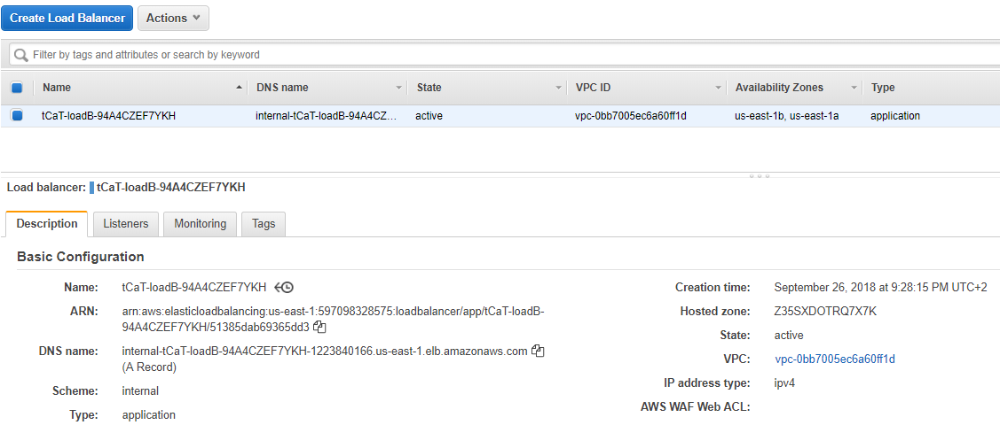
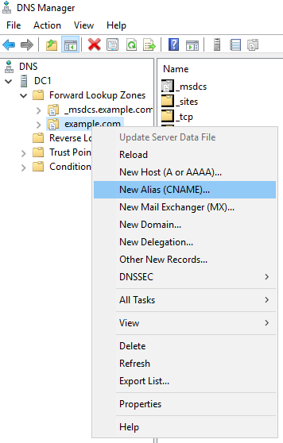
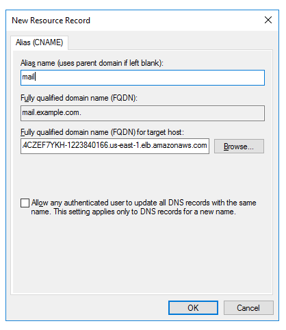
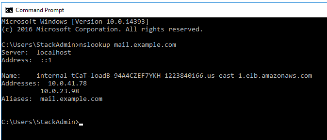

// Add steps as necessary for accessing the software, post-configuration, and testing. Don’t include full usage instructions for your software, but add links to your product documentation for that information.
//Should any sections not be applicable, remove them

== Post-deployment steps
// If post-deployment steps are required, add them here. If not, remove the heading

=== Run Windows Updates

In order to ensure the deployed servers' operating systems and installed applications have the latest Microsoft updates, run Windows Update on each server.

1. Create an RDP session from the Remote Desktop Gateway server to each deployed server.
2. Open the *Settings* application.
3. Open *Update & Security*.
4. Click *Check for updates*.
5. Install any updates and reboot if necessary.

=== (Optional) Create database copies

The Quick Start creates a database availability group (DAG) and adds the Exchange nodes to the DAG. As part of the Exchange installation, each Exchange node contains a mailbox database. The first node contains a database called DB1, and the second node contains a database called DB2.

As part of configuring high availability for the mailbox roles, you can add mailbox database copies on the other Exchange nodes. Alternatively, you can create entirely new databases and only then create additional copies.

To create a second copy for the initial databases, use the following commands:

----
Add-MailboxDatabaseCopy -Identity DB1 –MailboxServer ExchangeNode2 -ActivationPreference 2

Add-MailboxDatabaseCopy -Identity DB2 –MailboxServer ExchangeNode1 -ActivationPreference 2
----

=== (Optional) Create a DNS entry for the load balancer

1.  If you chose the option to deploy a load balancer, the Network Load Balancer (NLB) will have an endpoint address such as [elb.amazonaws.com].
2.  To use the load balancer with your Exchange namespace, create a CNAME record in Active Directory that points to the ALB.
3.  Before proceeding, go to the https://console.aws.amazon.com/ec2/v2/home[Amazon EC2 console] and, under *Load balancer*, select the load balancer that the Quick Start created.
4.  Copy the value listed under the DNS name, as shown in Figure 7.

[#architecture7]
.Creating a DNS entry for the load balancer

[start=5]
5.  To create the DNS record, connect using Remote Desktop to one of the domain controllers using domain credentials, and open the DNS console by going to the Start menu and typing “DNS”.
6.  In the DNS console, navigate to the Active Directory zone, right-click, and select *New Alias (CNAME)*, as shown in Figure 8.

[#architecture8]
.Selecting New Alias (CNAME)

[start=7]
7.  Create the DNS entry such as “mail” and in *fully qualified domain name (FQDN) for target host*, paste the value of the Application Load Balancer endpoint, as shown in Figure 9.

[#architecture9]
.Creating the DNS entry (“mail”)

[start=8]
9.  Verify that the DNS entry is resolved successfully by performing an nslookup. Go to Start and type “cmd”. In the command line window, type the following:

Nslookup *mail*._example.com_

_______________________________________________________________________________________________________________
Where mail is the name of the CNAME record you created, and “example.com” is your Active Directory domain name.
_______________________________________________________________________________________________________________

[start=10]
10.  Ensure that the record resolves to the load balancer DNS record, such as shown in Figure 10.

[#architecture10]
.Verifying the DNS record

== Best practices for using {partner-product-short-name} on AWS
// Provide post-deployment best practices for using the technology on AWS, including considerations such as migrating data, backups, ensuring high performance, high availability, etc. Link to software documentation for detailed information.

The architecture built by this Quick Start supports AWS best practices for high availability and security.

[[high-availability-and-disaster-recovery]]
=== High availability and disaster recovery

Amazon EC2 provides the ability to place instances in multiple locations composed of AWS Regions and Availability Zones. Regions are dispersed and located in separate geographic areas. Availability Zones are distinct locations within a Region that are engineered to be isolated from failures in other Availability Zones and that provide inexpensive, low-latency network connectivity to other Availability Zones in the same Region.

By launching your instances in separate Regions, you can design your application to be closer to specific customers or to meet legal or other requirements. By launching your instances in separate Availability Zones, you can protect your applications from the failure of a single location. Exchange provides infrastructure features that complement the high availability and disaster recovery scenarios supported in the AWS Cloud.

[[automatic-failover]]
=== Automatic failover

Deploying the Quick Start with the *default parameters* configures a two-node database availability group (DAG) with a file share witness. The DAG uses Windows Server Failover Clustering for automatic failover.

The Quick Start implementation supports the following scenarios:

* Protection from the failure of a single instance
* Automatic failover between the cluster nodes
* Automatic failover between Availability Zones

However, the Quick Start default implementation doesn’t provide automatic failover in every case. For example, the loss of Availability Zone 1, which contains the primary node and file share witness, would prevent automatic failover to Availability Zone 2. This is because the cluster would fail as it loses quorum. In this scenario, you could follow manual disaster recovery steps that include restarting the cluster service and forcing quorum on the second cluster node (e.g., ExchangeNode2) to restore application availability.

The Quick Start also provides an option to deploy into three Availability Zones. This deployment option can mitigate the loss of quorum in the case of a failure of a single node. However, you can select this option only in AWS Regions that include three or more Availability Zones; for a current list, see https://aws.amazon.com/about-aws/global-infrastructure/[AWS Global Infrastructure].

We recommend that you consult the https://docs.microsoft.com/en-us/Exchange/exchange-server?view=exchserver-2019[Microsoft Exchange Server documentation] and customize some of the steps described in this guide or add ones (e.g., deploy additional cluster nodes and configure mailbox database copies) to deploy a solution that best meets your business, IT, and security requirements.

[[security-groups-and-firewalls]]
=== Security groups and firewalls

When the EC2 instances are launched, they must be associated with a security group, which acts as a stateful firewall. You have complete control over the network traffic entering or leaving the security group, and you can build granular rules that are scoped by protocol, port number, and source or destination IP address or subnet. By default, all traffic egressing a security group is permitted. Ingress traffic, on the other hand, must be configured to allow the appropriate traffic to reach your instances.

The https://d0.awsstatic.com/whitepapers/aws-microsoft-platform-security.pdf[Securing the Microsoft Platform on Amazon Web Services] whitepaper discusses the different methods for securing your AWS infrastructure. Recommendations include providing isolation between application tiers using security groups. We recommend that you tightly control ingress traffic, so that you reduce the attack surface of your EC2 instances.

Domain controllers and member servers require several security group rules to allow traffic for services such as AD DS replication, user authentication, https://docs.microsoft.com/en-us/windows-server/networking/windows-time-service/windows-time-service-top[Windows Time service], and Distributed File System (DFS), among others. The nodes running Exchange Server permit full communication between each other, as recommended by Microsoft best practices. For more information, see https://blogs.technet.microsoft.com/exchange/2013/02/18/exchange-firewalls-and-support-oh-my[Exchange, Firewalls, and Support].

Edge node servers (if configured to be deployed) allow port 25 TCP (SMTP) from the entire internet.

The Quick Start creates certain security groups and rules for you. For a detailed list of port mappings, see the https://docs.aws.amazon.com/quickstart/latest/active-directory-ds/security.html[Security section] of the Active Directory Domain Services Quick Start deployment guide, and the link:#security[Security section] of this guide.

== Security
// Provide post-deployment best practices for using the technology on AWS, including considerations such as migrating data, backups, ensuring high performance, high availability, etc. Link to software documentation for detailed information.

AWS provides a set of building blocks (for example, Amazon EC2 and Amazon VPC) that you can use to provision infrastructure for your applications. In this model, some security capabilities, such as physical security, are the responsibility of AWS and are highlighted in the https://d0.awsstatic.com/whitepapers/aws-security-best-practices.pdf[AWS security whitepaper]. Other areas, such as controlling access to applications, fall on the application developer and the tools provided in the Microsoft platform.

This Quick Start configures the following security groups for Exchange Server:

[cols=",,,",options="header",]
|=======================================================================
|Security group |Associated with |Inbound source |Ports
|DomainMemberSGID |Exchange nodes, FileServer, RD Gateway, Domain controllers |VPC CIDR |Standard AD ports
|EXCHClientSecurityGroup |Exchange nodes, FileServer |VPC CIDR |25, 80, 443, 143, 993, 110, 995, 587
|ExchangeSecurityGroup |Exchange nodes |ExchangeSecurityGroup |All ports
|EXCHEdgeSecurityGroup |EXCHEdgeSecurityGroup |Private subnets CIDR, 0.0.0.0/0 |50636, 25
|LoadBalancerSecurityGroup |Load balancer |0.0.0.0/0 |0.0.0.0/0
|=======================================================================
