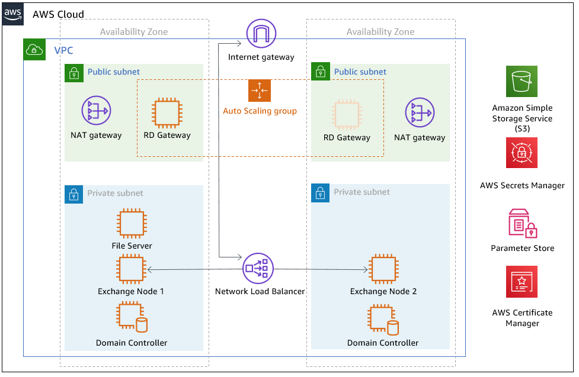
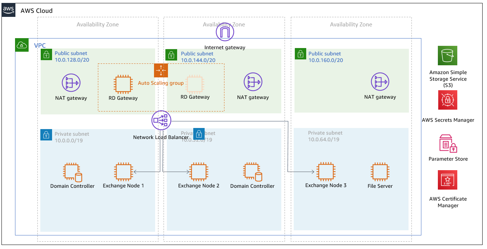
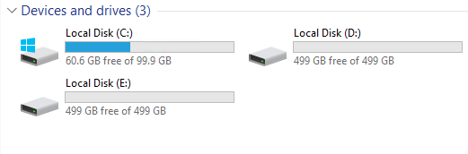
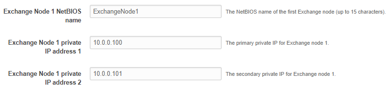
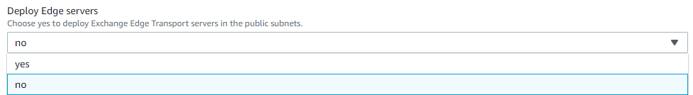

Before you deploy the template in this Quick Start, decide whether to use two Availability Zones or three, and whether to use a https://docs.microsoft.com/en-us/windows-server/failover-clustering/manage-cluster-quorum[file share witness] or a full node.

By default, the Exchange Server Quick Start uses two Availability Zones, with one Exchange node in each zone. The file share witness is launched in the same Availability Zone as the first Exchange node.

*Note*: Where possible, we recommend deploying the Exchange Server Quick Start using three Availability Zones. This enables automatic failover of database availability groups (DAGs), without the need for manual intervention.

You can deploy a full Exchange node instead of a file share witness. In addition, you can specify whether to deploy the full node or the file share witness in a third Availability Zone.

To learn more about Exchange DAGs and quorum models, see https://technet.microsoft.com/en-us/library/dd979799[TechNet – database availability groups].

In addition, you can deploy an internal Application Load Balancer (ALB) to provide high availability and distribute traffic to the Exchange nodes. In this configuration, you need to import a Secure Sockets Layer (SSL) certificate into AWS Certificate Manager (ACM) before you launch the template.

AWS Secrets Manager is used to securely store the Exchange administrative account credentials. AWS Systems Manager Parameter Store is used to retrieve the credentials.

Deploying this Quick Start for a new virtual private cloud (VPC) with default parameters builds the following {partner-product-short-name} environment in the AWS Cloud.

// Replace this example diagram with your own. Send us your source PowerPoint file. Be sure to follow our guidelines here : http://(we should include these points on our contributors giude)
:xrefstyle: short
[#architecture1]
.Quick Start architecture for {partner-product-short-name} on AWS

You can also choose to build an architecture with three Availability Zones, as shown in the following figure:

[#architecture2]
.Quick Start architecture for {partner-product-short-name} across three Availability Zones on AWS

As shown in <<architecture1>>, the Quick Start sets up the following:

* A highly available architecture that spans two or three Availability Zones.*
* A VPC configured with public and private subnets, according to AWS best practices, to provide you with your own virtual network on AWS.*
* In the public subnets:
** Managed network address translation (NAT) gateways to allow outbound internet access for resources in the private subnets.*
** A Remote Desktop Gateway in an Auto Scaling group to allow inbound Remote Desktop Protocol (RDP) access to EC2 instances in public and private subnets.*
* In the private subnets:
** Active Directory domain controllers.
** Windows Server EC2 instances as Exchange nodes.
** (Optional) In the public subnets, Exchange Edge Transport servers for routing internet email in and out of your environment.
// Add bullet points for any additional components that are included in the deployment. Make sure that the additional components are also represented in the architecture diagram. End each bullet with a period.

[.small]#*The template that deploys the Quick Start into an existing VPC skips the components marked by asterisks and prompts you for your existing VPC configuration.#

[[implementation-details]]
=== Implementation Details

[[storage-on-the-exchange-nodes]]
==== Storage on the Exchange Nodes

Storage capacity and performance are key aspects of any production installation. Although capacity and performance vary from one deployment to the next, this Quick Start provides a reference configuration that you can use as a starting point. The AWS CloudFormation template deploys the Exchange nodes using the memory-optimized r5.xlarge instance type by default.

To provide highly performant and durable storage, we’ve also included Amazon EBS volumes in this reference architecture. EBS volumes are network-attached disk storage, which you can create and attach to EC2 instances. Once these are attached, you can create a file system on top of these volumes, run a mailbox database, or use them in any other way you would use a block device. EBS volumes are placed in a specific Availability Zone, where they are automatically replicated to protect you from the failure of a single component.

Provisioned IOPS EBS volumes offer storage with consistent and low-latency performance. They are backed by solid state drives (SSDs) and are designed for applications with I/O-intensive workloads such as databases.

Amazon EBS-optimized instances, such as the R5 instance type, deliver dedicated throughput between Amazon EC2 and Amazon EBS. The dedicated throughput minimizes contention between Amazon EBS I/O and other traffic from your Amazon EC2 instance, and provides the best performance for your EBS volumes.

By default, on each Exchange node, the Quick Start deploys three 500-GiB General Purpose (GP2) SSD volumes to store mailbox databases and transaction logs. The database and log partitions are formatted using GUID Partition Table ( GPT).

By default, partitions are created using Resilient File System (ReFS), which is the Preferred Architecture (PA) choice for Exchange Server 2016 and Exchange Server 2019. If you set the Enable or disable ReFS parameter to *false*, the partitions are formatted using NTFS.

The GP2 volume type delivers a consistent baseline of 3 IOPS/GiB, which provides a total of 1,500 IOPS per volume for Exchange database and transaction log volumes. You can customize the volume size, and you can switch to using dedicated IOPS volumes.

If you need more IOPS per volume, consider using Provisioned IOPS SSD volumes by changing the *Exchange Server Volume Type* and *Exchange Server Volume IOPS* parameters, or use disk striping within Windows.

The default disk layout in this Quick Start uses the following EBS volumes:

* One General Purpose SSD volume (100 GiB) for the operating system (C:)
* One General Purpose SSD volume (500 GiB) to host the Exchange Server database files (D:)
* One General Purpose SSD volume (500 GiB) to host the Exchange Server transaction log files (E:)

The following figure shows the disk layout on each Exchange Server node:

[#architecture3]
.Disk layout on Exchange Server node

*Note* You’ll find the installation software on each node in the *C:\Exchangeinstall* folder.

Depending on the instance type selected, you might see additional drives for instance store (ephemeral) volumes such as (Z:). Data on instance storage will be lost when you stop your EC2 instance.

[[ip-addresses-on-the-exchange-nodes]]
==== IP Addresses on the Exchange nodes

By default, the Microsoft Exchange Quick Start template deploys two Exchange nodes with two IP addresses each:

* One IP address is used as the primary IP address for the instance.
* A second IP address acts as the Failover Cluster IP resource.

When you launch the AWS CloudFormation template, you can specify the addresses for each node, as shown in Figure 4. By default, the 10.0.0.0/19, 10.0.32.0/19, and 10.0.64.0/19 CIDR blocks are used for the private subnets.

[#architecture4]
.Configuring IP addresses on the Exchange node

[[database-availability-group]]
==== Database Availability Group

A failover cluster is automatically created for the database availability group (DAG). The AWS CloudFormation templates carry out this task when deploying the second node. If you use the default parameter settings in the template, the Quick Start runs the following Windows PowerShell commands to complete this task:

----
Install-WindowsFeature failover-clustering –IncludeManagementTools

New-DatabaseAvailabilityGroup -Name DAG -WitnessServer FileServer

-WitnessDirectory C:\DAG

Add-DatabaseAvailabilityGroupServer -Identity DAG

-MailboxServer ExchangeNode1

Add-DatabaseAvailabilityGroupServer -Identity DAG

-MailboxServer ExchangeNode2
----

*Note*: By default, the database availability group is created with the name DAG. To change this value, modify the DAGName default parameter value in the Configure-ExchangeDAG.ps1 file.

The first command runs on each instance during the bootstrapping process. It installs the required components and management tools for the failover clustering services. The rest of the commands run near the end of the bootstrapping process on the second node and are responsible for creating the cluster and for defining the server nodes and IP addresses.

By default, the Quick Start configures an even number of servers in the cluster. You need a third resource to maintain a majority vote to keep the cluster online if an individual server fails. For this, the Quick Start uses a dedicated file share witness instance, which can be either a domain-joined server or a third Exchange node (which cannot be part of the DAG itself). By default, the Quick Start creates a Dedicated Instance in the first Availability Zone to act as the file share witness. For production environments, you can also set the *Third AZ* parameter to *witness* to create a Dedicated Instance with a file share in a third Availability Zone.

Alternatively, you can use any domain-joined server for this task. (This isn’t included in the Quick Start.) If you set the *Third AZ* parameter to *full*, the Quick Start keeps the quorum settings to the default node majority and creates a third Exchange Server node in the third Availability Zone. Note that some AWS Regions support only two Availability Zones; for a current list, see https://aws.amazon.com/about-aws/global-infrastructure/[AWS Global Infrastructure].

The Quick Start automated solution ends after creating the DAG and adding the two Exchange nodes to the DAG. When the deployment is complete, you can create additional databases and make them highly available by creating copies on the second nodes. This process is covered in link:#step-3.-optional-create-database-copies[step 3] of the deployment instructions.

[[edge-transport-nodes]]
==== Edge Transport Nodes

Edge Transport nodes relay inbound and outbound emails and provide smart host services within the Exchange organization. The Edge nodes are installed in the public subnets and aren’t domain-joined. However, they do require information from Active Directory, and configuring an Edge sync subscription is needed.

Because Edge Transport role nodes aren’t required for end-to-end mail flow, by default, Edge nodes aren’t deployed. For this to occur, you must select *yes* on the *Deploy Edge servers* launch option, as shown in the following figure:

[#architecture5]
.Deploying Edge servers

A pair of Edge servers is deployed in the public subnets (which must be defined), and the Exchange Server Edge Transport role is installed using default settings. The EC2 instances aren’t domain-joined, but the DNS suffix that corresponds to the domain name is configured on the network interface cards (NICs). Also, DNS records are created in Active Directory corresponding to their hostname.

The Local Administrator password is reset to the Domain Admin password, and an Edge subscription file is created, which can be found in C:\EdgeServerSubscription.xml.

Copy the subscription file to a *mailbox* server, and import the subscription by running the following command:

New-EdgeSubscription -FileData ([byte[]]$(Get-Content -Path "C:\EdgeServerSubscription.xml" -Encoding Byte -ReadCount 0)) -Site "AZ1"

[[load-balancer]]
==== Load balancer

Exchange servers running with the Client Access/Transport roles are usually situated behind a network load balancer (NLB) with a unified Exchange namespace such as “mail.example.com.” The namespace resolves to the load balancer, which in turns distributes traffic to the Exchange servers.

The Exchange Server Quick Start contains an option to deploy an Application Load Balancer that distributes the traffic to the Exchange nodes.

By default, the load balancer isn’t deployed because it requires an existing SSL certificate to be imported in AWS Certificate Manager.

For a load balancer to be deployed, you must:

1.  Import or generate a certificate in AWS Certificate Manager.
2.  Specify the full Amazon Resource Name (ARN) in the CertificateARN option.
3.  Select *true* in *Deploy Load Balancer*, when you launch the Quick Start.

[[volume-encryption]]
==== Volume Encryption

As part of the default setup, the Exchange Server Quick Start creates and attaches two EBS volumes to each Exchange node. One EBS volume (corresponding to the D:\ drive) holds the Exchange mailbox databases, while the other EBS volume (E:\) holds the Exchange transaction logs.

Optionally, the Quick Start provides an option to encrypt the EBS volumes with either the default AWS Key Management Service (AWS KMS) encryption key or a custom KMS key, as shown in the following figure:

[#architecture6]
.Encrypting the EBS volumes

*Note* The root volume of the Exchange nodes (C:\) isn’t encrypted, if *Encrypt data volumes* is selected.
